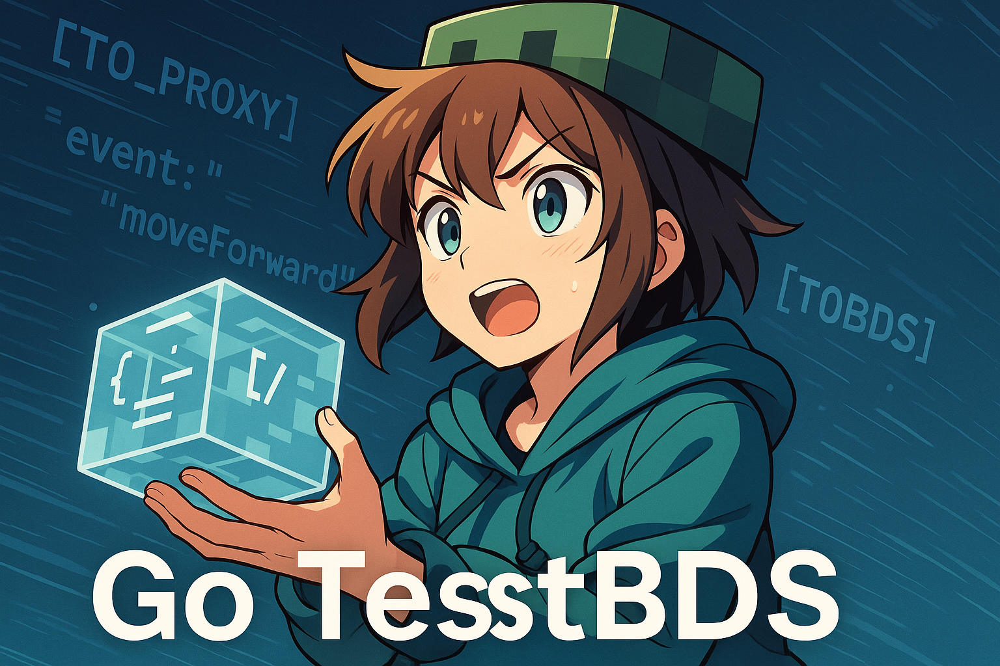

# GO TEST BDS

## Overview

GoTestBDS is a designed to be a complete end-to-end testing framework for Minecraft Bedrock Dedicated Servers written in Go. GoTestBDS is built on top of [GopherTunnel](https://github.com/Sandertv/gophertunnel) and gives the ability to register fake clients to test your Script API BDS Addons.

## Features

- [x] Connect Fake Clients to a BDS Server
- [x] Implements all [clientOriginating](https://github.com/Sandertv/gophertunnel/blob/master/minecraft/protocol/packet/pool.go#L279) packets to simple JSON interfaces
- [x] Parses text packets from the BDS Server to JSON
- [x] Sends text JSON packets to the BDS Server
- [x] Smooth Navigation simulation
- [x] Full UI and Form Automation

## Installation

...

## Writing Tests

...

## License

...

## API

To call the API from the server side, you must send a JSON message with the prefix `[RUN_ACTION]`, which must contain two fields:
The first: “action” — this is like the name of the function.
The second: “parameters” — theis is like the parameters that you pass to the function.

Example: `[RUN_ACTION]{"action":"placeBlock","parameters":{"pos":[100,60,-10]}}`

For list of all instructions follow https://github.com/smell-of-curry/go-test-bds/tree/main/gotestbds/instruction

