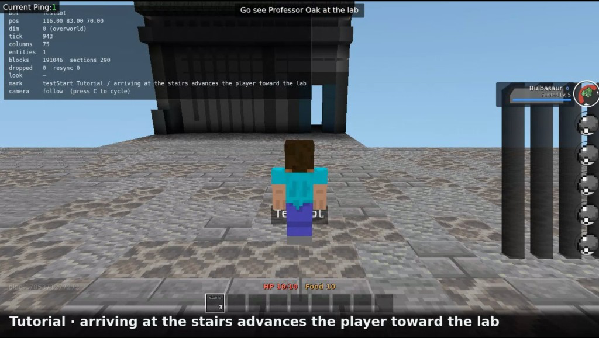

# GO TEST BDS



End-to-end testing for Minecraft Bedrock Dedicated Server addons.

GoTestBDS connects headless clients to your BDS instance and hands your Script
API addon a way to drive them. Because the bots are real network clients, a test
exercises the same code a player does: the same packets, the same forms, the same
rejections. It is built on [GopherTunnel](https://github.com/Sandertv/gophertunnel).

Two halves ship together:

- **A Go binary** that connects one or more bots and carries out instructions.
- **A TypeScript SDK** (`./scripts`) your addon imports to write tests: a bot
  wrapper, a test runner, assertions, waits, and a machine-readable report
  format for CI.

## Quick start

### 1. Run the bots

```bash
go run . --address 127.0.0.1:19134 --name "Test Bot" --bots 1
```

Every flag also reads from the environment (`GOTESTBDS_ADDRESS`,
`GOTESTBDS_BOT_NAME`, `GOTESTBDS_BOTS`, `GOTESTBDS_LOG_LEVEL`) and from
`config.toml`, in that order of precedence — flags win, then environment, then
file. That makes the same binary usable from a shell, a CI job and an
orchestrator without three ways to configure it.

Point `--address` at BDS directly, not at a proxy. Bots have no Xbox Live
identity, so they need an instance with `online-mode=false` and the allowlist
off — normally a dev or staging instance bound to loopback.

### 2. Install the SDK in your addon

```bash
npm i github:smell-of-curry/go-test-bds
```

### 3. Write a suite

```typescript
import { assert, assertEventually, defineSuite } from "go-test-bds";

export const shrineSuite = defineSuite({
  name: "Shrines",
  tests: [
    {
      name: "using the orb on a frozen shrine spawns its Pokémon",
      async run(ctx) {
        const shrine = { x: 2, y: 60, z: 0 };
        ctx.bot.player.dimension.setBlockType(shrine, "pokeb:frozen_shrine");
        ctx.track(() =>
          ctx.bot.player.dimension.setBlockType(shrine, "minecraft:air"),
        );

        giveOrb(ctx.bot.player);
        await ctx.bot.interactWithBlock(shrine);

        await assertEventually(() => shrineHasSpawned(shrine), {
          timeoutMs: 10_000,
          description: "the shrine to spawn its Pokémon",
        });
      },
    },
  ],
});
```

### 4. Run it from your addon

```typescript
import { Bot, runSuites } from "go-test-bds";

const bot = await Bot.waitForJoin("Test Bot", { timeoutMs: 60_000 });
const result = await runSuites([shrineSuite], { bots: [bot] });
```

Trigger that from a script event so CI can start a run over the BDS console
rather than by editing the addon:

```
scriptevent yourns:run {"runId":"ci-123"}
```

## How the protocol works

The addon and the bot talk over chat, because that is the only bidirectional
channel a Script API addon has to a client.

The addon sends an instruction as a message to the bot's player, prefixed
`[RUN_ACTION]`. The bot performs it and replies with a `[STATUS]` message that
the addon intercepts in `beforeEvents.chatSend` and cancels, so it never reaches
other players.

Each instruction carries an `id`. Responses echo it, which is what makes
concurrent instructions and per-instruction timeouts possible — without
correlation, two bots acting at once would resolve each other's promises. A
response may also carry a `data` payload, which is how observation instructions
(`getState`, `getInventory`, `getForm`, `getBlock`, `getNearbyEntities`,
`getMessages`) return what the *client* sees rather than what the server
believes.

`scripts/client.ts` implements all of this. You should not need to build an
envelope by hand; use `Bot` or, for an instruction the wrapper does not cover
yet, `runAction` / `runActionForData`.

### What the client is and is not told

An observation answers with the client's own copy, which is the point — it is
how a test catches a desync a server-side assertion cannot see. That copy is
only as good as what BDS pushes, and BDS does not push everything:

- **Blocks** arrive normally. With `block-network-ids-are-hashes` (the BDS
  default) a chunk's palette holds hashes rather than runtime IDs, and chunks
  themselves arrive through sub-chunk requests; the bot handles both, plus the
  `UpdateSubChunkBlocks` packets a server sends for its own edits.
- **Inventory** does not. BDS never tells the client about an inventory write
  made through the Script API — `Container.setItem`, `addItem`, `swapItems`,
  `EntityEquippable.setEquipment` all leave the client's copy stale, and no
  client-side action forces a refresh. Only a real inventory transaction, such
  as `/give` or `/replaceitem`, resyncs the window, and it resyncs all of it.
  `Bot.getInventory` therefore forces one server-side (a marker item added and
  cleared again) before reading. Pass `{ sync: false }` to read the stale copy
  deliberately — that is how you assert what the client has *not* been told.

## What the SDK gives you

| Module | Purpose |
|-----|-----|
| `bot.ts` | `Bot` — actions (chat, navigate, interact, break, forms) and observations (state, inventory, blocks, nearby entities, messages) |
| `runner.ts` | `defineSuite`, `runSuites` — suites, per-test timeouts, tag filtering, hooks, `ctx.track` cleanups that run even when a test fails, and `ctx.screenshot` |
| `assert.ts` | Minecraft-shaped assertions: `assertNearPosition`, `assertBlockAt`, `assertEventually`, … |
| `wait.ts` | `waitFor`, `waitForValue`, `retry`, `sleep` — polling with timeouts that name what they were waiting for |
| `reporter.ts` | `ConsoleReporter` for humans, `StructuredReporter` for CI (`[GOTESTBDS]`-prefixed JSON lines on stdout) |
| `protocol.ts` | The wire format, if you are building your own client |

### Walking dialogue chains

Most addons talk to players through chained forms. Naming every button makes a
test depend on wording that is translated and that designers change, so walk the
chain positionally and stop on a condition the server can observe:

```typescript
await ctx.bot.clickThrough({
  until: () => getQuestStep(ctx.bot.player) === "accepted",
  description: "the quest to be accepted",
  onForm: (form) => ctx.log(`answered "${form.title}"`),
});
```

### Seeing what the bot saw

The optional **viewer** is an HTTP hub on the bot (`gotestbds/viewer/`) that
streams world snapshots and serves a three.js web app. Turn it on with
`-viewer` (plus `-viewer-address`, `-viewer-artifacts`, `-viewer-app` as needed),
the matching `GOTESTBDS_VIEWER*` env vars, or a `[Viewer]` section in
`config.toml`. Details and the capture harness live in
[`viewer/README.md`](viewer/README.md); the wire contract is
[`viewer/PROTOCOL.md`](viewer/PROTOCOL.md).

With a viewer attached, a test can capture a still of the bot's view. It
returns null instead of throwing when nobody is rendering, so the same test
runs unchanged without a viewer:

```typescript
await ctx.screenshot("after-the-shrine-lights-up");
```

Stills and one whole-run video (`run.webm`) are reported as artefacts on the
`testEnd` and `runEnd` events. Capture is best effort — unregistered
`screenshot` / missing harness never fails a test.

### Reporting to CI

`StructuredReporter` prints one JSON object per event, prefixed
`[GOTESTBDS]`, to BDS stdout:

```
[GOTESTBDS]{"kind":"testEnd","suite":"Shrines","name":"...","status":"passed","durationMs":812}
[GOTESTBDS]{"kind":"runEnd","runId":"ci-123","totals":{"total":1,"passed":1,"failed":0,"skipped":0}}
```

Whatever supervises BDS can tail stdout, aggregate those events, and decide a
build's fate without parsing human-readable log output.

## Regenerating instruction types

The TypeScript instruction parameter types are generated from the Go
instruction structs, so the two cannot drift:

```bash
npm run generate:types
```

Adding an instruction means adding it in `gotestbds/instruction/`, registering it
in `pull.go`, regenerating, and — if it is worth a friendlier signature — adding a
method to `Bot`.

## License

...
